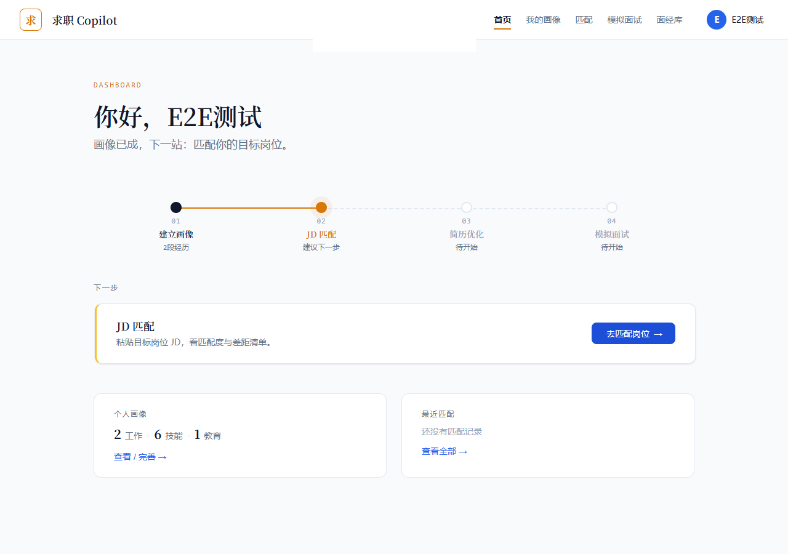
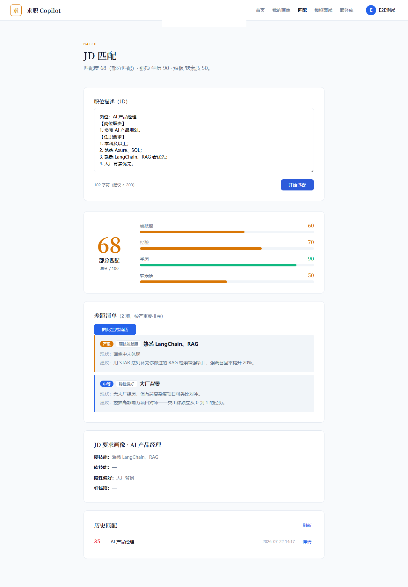
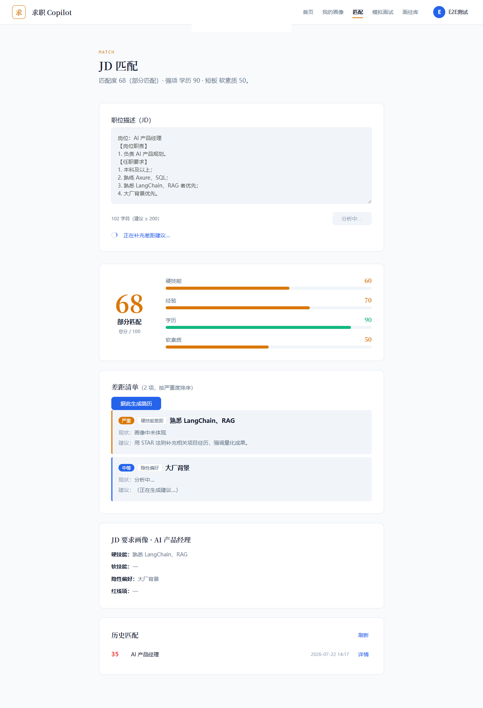
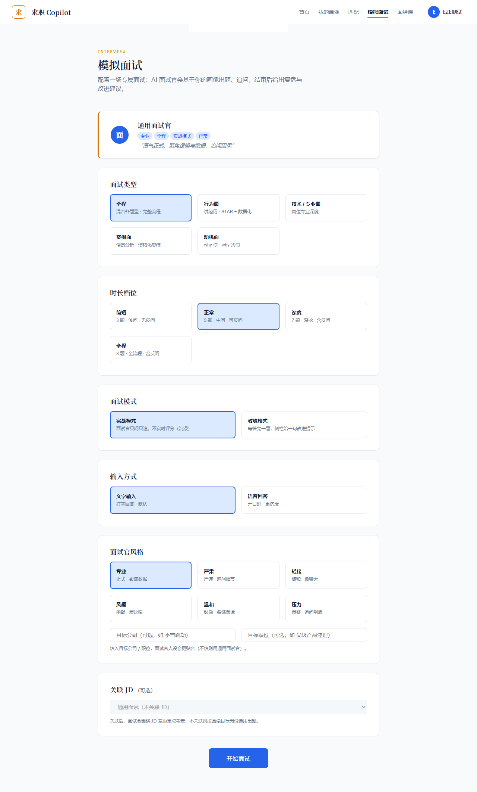
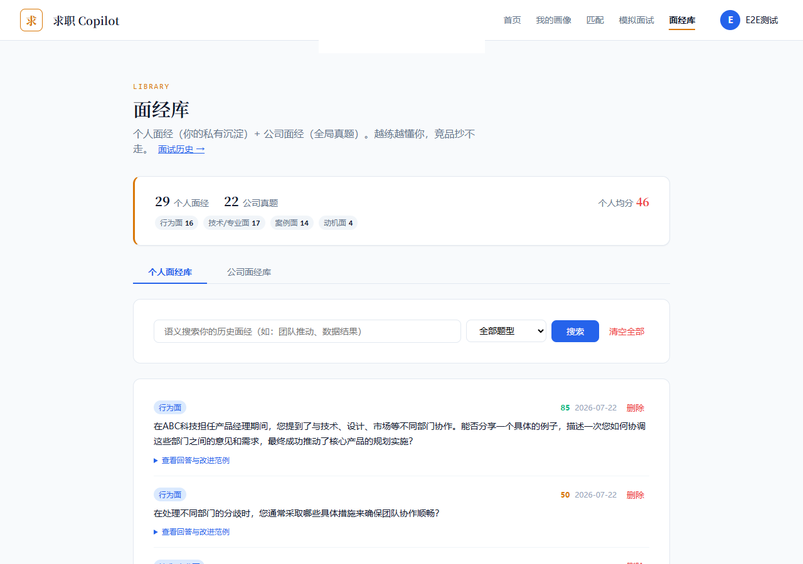

# 求职 Copilot（job-copilot）

> 基于 **LangGraph** 的全链路 AI 求职 Agent —— 带记忆的私人求职教练

---

## 这是什么

一个用 **Python（FastAPI + LangGraph）** 写后端、**Vue 3** 写前端的 AI 求职助手。它能陪你走完求职全链路，每一步都沉淀为可复用的「用户画像」，越用越懂你：

| 能力 | 说明 | 前端页面 |
|------|------|----------|
| 📋 **建立画像** | 上传简历自动解析，结构化为用户画像，作为后续所有能力的基础 | 简历解析 / 画像 |
| 🎯 **JD 匹配分析** | 解析岗位要求，评估匹配度，指出 Gap 并给出应对建议 | JD 匹配 |
| 📝 **简历定制优化** | 画像驱动 + 目标岗位定向改写（STAR 法则，校验「绝不编造」），支持多主题导出 | 简历优化 / 精修 / 历史 |
| 🎤 **模拟面试** | 多轮对话面试 + 按图索骥的实时追问 + 语音作答 + 结构化复盘报告 | 面试配置 / 面试间 / 复盘 |
| 📚 **面经库（RAG）** | 个人/公司面经沉淀，向量检索，为出题与复盘提供弹药 | 面经库 |

**差异化**：市面工具多是单点（只改简历 / 只模拟面试）。本项目把「画像 → 匹配 → 简历 → 面试 → 复盘」做成一条带长期记忆的闭环——前序环节的产物，会被后续环节自动复用。

---

## 界面速览

**① 首页 · 求职作战看板** —— 四步闭环的进度可视化 + 「下一步做什么」引导



**② JD 匹配 · 匹配度 + 差距清单** —— 四维打分 + 按严重度排序的 Gap 与应对建议（结果分两阶段流式产出：先出分数与维度，再逐条补齐差距建议）



<details>
<summary>展开：流式过程中的中间态（差距建议逐条补齐）</summary>



</details>

**③ 模拟面试 · 面试配置** —— 题型 / 时长档位 / 实战与教练两种模式 / 六档面试官风格 / 文字与语音作答



**④ 面经库 · RAG 检索** —— 个人面经沉淀 + 公司真题，语义检索反哺出题与复盘



---

## 技术架构

### 后端（[backend/](backend/)）

- **FastAPI** — API 服务 · **SQLAlchemy + SQLite** — 数据持久化（用户/画像/简历/面试会话/面经）
- **LangGraph** — 状态机驱动的 Agent 编排（核心）；LangChain `ChatOpenAI` 接入 LLM
- **LLM**：默认接 **智谱 GLM**（OpenAI 兼容接口，可一键切 DeepSeek / OpenAI / 通义），**分层选模**——评估/对话用快档 `glm-4-flash`（低延迟、免费），出题/复盘/简历/JD 解析用主力档 `glm-4.5`（重质量）
- **语音**：本地 **faster-whisper** 转写，零侵入接入面试链路
- **RAG**：**numpy + 智谱 embedding** 做向量检索的轻量面经库（生产可换专用向量库）

> **为什么用 LangGraph？** 它把 Agent 的「流程」显式建模成**状态机**（节点 = 函数，边 = 流转），可控、可调试、可断点续跑——比裸调 API 更能体现工程能力。三张状态机（主图 / 面试子图 / 简历精修子图）的分工见下面的「AI 核心设计」，实现细节见 [backend/README.md](backend/README.md)。

### 前端（[web/](web/)）

- **Vue 3 + TypeScript** · **Vite** · **Element Plus** · **Pinia**（状态管理）· **Vue Router** · **Axios** · **SCSS**
- **Playwright** 端到端测试

---

## 快速开始

> **端口说明**：后端跑在 **`http://localhost:8001`**（8000 端口被本机打印服务占用，故避让）；前端跑在 **`http://localhost:3000`**，已配好 `/api` 代理到 8001。

### 环境要求

- Python 3.10+、Node.js 16+、一个 LLM API Key（推荐智谱，有免费额度）

### 1. 配置 LLM API Key

复制模板并填入 Key（参考 [`.env.example`](.env.example)）：

```bash
cp .env.example backend/.env     # Git Bash；PowerShell 用 Copy-Item .env.example backend/.env
```

编辑 `backend/.env`，**唯一必填的是 `LLM_API_KEY`**，其余都有可用默认值：

```bash
LLM_API_KEY=你的智谱Key          # 注册：https://open.bigmodel.cn/
LLM_BASE_URL=https://open.bigmodel.cn/api/paas/v4
LLM_MODEL=glm-4-flash            # 快档（评估/对话）
LLM_MODEL_STRONG=glm-4.5         # 主力档（出题/复盘/简历/JD 解析）
```

> ⚠️ `PORT` 保持模板里的 **8001**——前端 vite 代理写死指向 8001（见 [web/vite.config.ts](web/vite.config.ts)），改成别的端口前端就连不上。
>
> 想用 DeepSeek / OpenAI / 通义？只改 `LLM_BASE_URL` + 两个模型名 + Key，代码不用动。

### 2. 启动后端

```bash
cd backend
python -m venv .venv            # 建议用虚拟环境（首次）
source .venv/Scripts/activate   # Git Bash；PowerShell 用 .venv\Scripts\Activate.ps1
pip install -r requirements.txt
python -m playwright install chromium   # 简历 PDF 导出用（约 150MB，只需装一次）
python -m src.main               # 首次启动会自动建表；服务在 http://localhost:8001
```

> 启动命令是 `python -m src.main`（**模块**方式）。不要写成 `python src/main.py`——后者会把 `backend/src` 当成根目录，直接报 `ModuleNotFoundError: No module named 'src'`。
>
> 首次装依赖会偏慢：`faster-whisper`（语音转写）会带上 ctranslate2 / onnxruntime 等较大的包。

- API 文档（Swagger）：http://localhost:8001/docs
- 健康检查：http://localhost:8001/health

### 3. 启动前端

```bash
cd web
npm install                      # 首次运行
npm run dev                      # http://localhost:3000
```

### 4. 体验完整流程

打开 http://localhost:3000 → 注册（**验证码打印在后端控制台**）→ 登录 → 上传简历建画像 → JD 匹配 → 简历优化 → 模拟面试 → 查看复盘。

---

## 项目结构

```
job-copilot/
├── backend/                      # 后端：FastAPI + LangGraph
│   ├── src/
│   │   ├── main.py               # FastAPI 入口（注册路由、CORS、限流）
│   │   ├── api/                  # 路由层：auth / resume / resume_optimize / jd / interview / voice / knowledge
│   │   ├── graph/                # LangGraph 核心
│   │   │   ├── graph.py          # 图定义（状态机编排）
│   │   │   ├── state.py          # AgentState 状态定义
│   │   │   ├── nodes/            # 业务节点：profile / jd_match / resume_optimize / resume_refine / mock_interview
│   │   │   ├── prompts.py        # Prompt 集中管理
│   │   │   ├── checkpointer.py   # 多轮记忆持久化（SQLite checkpointer）
│   │   │   └── config.py         # LLM 初始化 + 分层选模
│   │   ├── services/             # 业务逻辑：解析/匹配/出题/RAG/语音/导出…
│   │   ├── models/               # SQLAlchemy 数据模型
│   │   ├── schemas/              # Pydantic 请求/响应
│   │   └── core/                 # 安全(JWT/bcrypt)、限流、日志
│   └── requirements.txt
├── web/                          # 前端：Vue 3 + TS
│   ├── src/
│   │   ├── views/                # 页面（登录/首页/画像/JD匹配/简历×4/面试×4/面经库）
│   │   ├── api/                  # 接口层（axios 封装）
│   │   ├── stores/               # Pinia 状态
│   │   ├── router/               # 路由 + 守卫
│   │   └── styles/               # 全局样式 / 设计 token
│   └── tests/e2e/                # Playwright 端到端测试
├── assets/screenshots/           # README 用的界面截图
├── openspec/                     # 规范驱动开发（先写 spec 再实现）
├── amlei-resume/                 # 简历能力的参考实现来源（非运行时依赖，见其 README）
├── src/                          # 早期 CLI 原型（已被 backend+web 全栈版本取代，仅留档）
├── backend/test_*.py             # 分阶段验证脚本（非单元测试，见 backend/README.md）
├── LICENSE
└── .env.example                  # 环境变量模板（复制为 backend/.env）
```

> `backend/` 根目录下的 `test_*.py` 是开发过程中**分阶段的验证脚本**（需要真实 LLM Key，用来验证某条链路在真实环境跑得通），不是单元测试套件；正式的自动化测试在前端的 `web/tests/e2e/`。


---

## AI 核心设计（面试讲点）

- **状态机编排（LangGraph）**：每个能力 = 一个节点 + 一条边，互不耦合；新增能力不用改旧代码。条件边做意图路由。
- **interrupt + checkpointer**：模拟面试用 LangGraph 的中断与 SQLite 检查点，实现「多轮追问 + 断点续跑 + 同一会话共享上下文」。
- **分层选模**：同一套 `get_llm(tier=...)` 接口，按任务对延迟/质量的敏感度自动切快档/主力档，平衡成本与效果。
- **画像驱动 + 防编造**：简历优化基于结构化画像改写，并跑「事实校验」防止 LLM 臆造经历。
- **零侵入语音**：语音回答走独立转写端点，不污染面试状态机主流程。
- **轻量 RAG**：面经库用 numpy + embedding 做检索，无需重型向量数据库即可演示召回效果。

---

## 配置说明

`backend/.env` 关键变量：

| 变量 | 说明 | 示例 |
|------|------|------|
| `LLM_API_KEY` | LLM 服务商 API Key | 智谱 / DeepSeek / OpenAI 的 key |
| `LLM_BASE_URL` | API 地址 | 智谱：`https://open.bigmodel.cn/api/paas/v4` |
| `LLM_MODEL` | 快档模型（评估/对话） | `glm-4-flash` |
| `LLM_MODEL_STRONG` | 主力档模型（质量任务） | `glm-4.5` |
| `PORT` | 后端端口（默认 8001） | `8001` |
| `FRONTEND_URL` | 前端地址（CORS 白名单） | `http://localhost:3000` |

> ⚠️ `.env` 含敏感信息，已在 `.gitignore` 排除，**请勿提交**。

---

## 路线图

- [x] **v0.1** 单节点对话 Agent（求职教练人设 + 多轮记忆）
- [x] **v0.2** 用户认证（注册/登录/验证码/JWT）+ 简历解析建画像
- [x] **v0.3** JD 匹配分析（解析 + 匹配度 + Gap 分析）
- [x] **v0.4** 简历定制优化（画像驱动 + 防编造校验 + 多主题导出 + 历史版本）
- [x] **v0.5** 模拟面试（多轮追问 + interrupt/checkpointer + 结构化复盘报告）
- [x] **v0.6** 面经库 RAG（向量检索，反哺出题与复盘）
- [x] **v0.7** 语音面试（faster-whisper 本地转写）
- [ ] **v1.0** 体验打磨、部署上线、性能优化

---

## 已知限制

如实列出，避免"看起来什么都能做"：

- **未部署上线**：`web/.env.production` 里的 API 域名是占位值，目前只能在本地跑。
- **限流仅 IP 级**：用户级限流未实现（见 [core/limiter.py](backend/src/core/limiter.py)）。
- **验证码不真发邮件**：开发环境打印到后端控制台，邮件通道留了接口未接（见 [code_service.py](backend/src/services/code_service.py)）。
- **SQLite 单机**：适合个人使用与演示，非并发场景。
- **语音转写是 CPU 推理**：`faster-whisper` small 模型在 CPU 上约数倍于音频时长，长回答会有等待。

---

## 相关文档

- 🔧 [后端 README](backend/README.md) — 启动方式、环境变量、真实 API 路由表、数据存储
- 🎨 [前端 README](web/README.md) — 功能特性、目录结构、开发与测试
- 📐 [openspec/](openspec/) — 规范驱动开发的过程记录（每个能力先写 spec 再实现）

> 产品方案（PRD / 商业分析 / AI 能力边界）与技术架构设计文档在本地单独维护，未随仓库公开。

---

*这是一个个人面试作品集项目，用于求职展示。* License: [MIT](LICENSE)