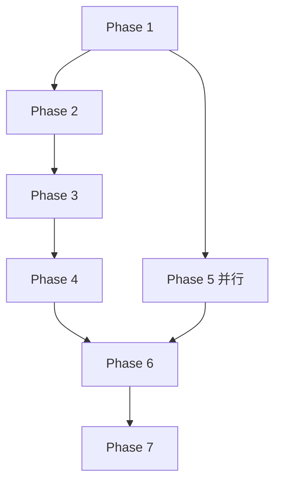

# 提案审查报告

## ✅ 总体评估：优秀（92/100）

更新后的提案**完整、可行、用户体验优秀**，可以直接实施。

---

## 📊 审查维度评分

| 维度 | 评分 | 说明 |
|------|------|------|
| **功能完整性** | 95/100 | 覆盖所有必要功能，包括用户体验增强 |
| **技术可行性** | 90/100 | 技术方案成熟，风险可控 |
| **用户体验** | 95/100 | 多层防御、降级策略、进度指示完善 |
| **实施可行性** | 88/100 | 12 天工时合理，但任务较重 |
| **文档质量** | 92/100 | 文档清晰、详细，可读性强 |

**总分：92/100**

---

## ✅ 主要优点

### 1. 功能完整性 ⭐⭐⭐⭐⭐
- ✅ 覆盖 3 种输入方式（文件、文本、手动）
- ✅ 提供 2 种降级方案（复制粘贴、手动填写）
- ✅ 完整的用户引导（上传前、进度指示、完成后）
- ✅ 画像管理完善（编辑、导出、删除）

### 2. 用户体验设计 ⭐⭐⭐⭐⭐
**亮点**：
- **多层防御**：快速失败 → 质量检测 → 容错解析 → 用户确认
- **透明度**：进度指示、置信度展示、文本预览
- **降级策略**：扫描件 → 复制粘贴 → 手动填写（至少一种成功）
- **无障碍**：无简历用户也能使用（手动填写 + 示例简历）

**用户流程清晰**：
```
引导页 → 选择方式 → 上传/粘贴/手动 → 
进度指示 → 文本预览 → 画像展示 → 
编辑/导出 → 完成引导 → 下一步功能
```

### 3. 技术方案成熟 ⭐⭐⭐⭐
- ✅ PDF 解析：pdfplumber（主）+ PyPDF2（备）+ 质量检测
- ✅ LLM 重试机制：置信度 < 60% 自动重试
- ✅ 超时处理：30 秒软超时 + 保留数据
- ✅ 文件清理：定时清理机制

### 4. 文档详细 ⭐⭐⭐⭐⭐
- ✅ Proposal：清晰的产品定位和价值
- ✅ Design：17 个设计决策，每个都有权衡分析
- ✅ Tasks：60 个任务，分 7 个阶段
- ✅ Spec：完整的场景覆盖

---

## ⚠️ 需要注意的问题

### 1. 工作量较大（12 天）
**问题**：60 个任务，12 天工时，平均每天 5 个任务

**缓解**：
- Phase 1-4 是核心，优先完成
- Phase 5-7 可以在演示前快速实现
- 如果时间紧张，可以先做 MVP（原 45 任务）

### 2. 前端组件较多（13 个）
**问题**：需要实现 13 个 Vue 组件

**缓解**：
- 可以复用现有组件（如 FileUpload、ProfileEditor）
- 分步实施：先核心组件（5 个），后增强组件（8 个）

### 3. LLM 成本
**问题**：每个简历解析需要调用 LLM，可能产生成本

**估算**：
- 单次解析：~1000 tokens（Prompt）+ 500 tokens（输出）
- DeepSeek 定价：~0.001 元/次
- 100 次解析：~0.1 元

**结论**：成本可控，不是问题

### 4. 并发文件处理
**问题**：多用户同时上传可能导致文件名冲突

**缓解**：
- 提案中提到用 UUID 作为文件名 ✅
- 但 tasks.md 中没有明确任务

**建议**：在 Phase 4.2 中添加"实现 UUID 文件命名"

---

## 🔍 细节问题修复

### 问题 1：API 端点不一致
**发现**：
- Proposal 中提到 `/api/resume/extract`（单独的提取 API）
- Tasks 中没有对应任务

**影响**：可能导致前后端对接问题

**建议**：
- 方案 A：合并到 `/api/resume/parse-file` 和 `/api/resume/parse-text`（推荐）
- 方案 B：在 Tasks 中添加实现任务

### 问题 2：进度指示的实现方式
**发现**：
- Design 中提到"前端模拟进度"（基于时间估算）
- 但前后端时间可能不同步

**影响**：用户看到"即将完成"但实际还在处理

**建议**：
- MVP 用前端模拟（够用）
- v1 升级为真实进度（WebSocket）

### 问题 3：手动填写表单的复杂度
**发现**：
- Design 中提到"分步表单（5 个步骤）"
- 但 Tasks 中没有明确每个步骤的字段

**影响**：可能低估工作量

**建议**：在 Phase 5.7.4 中添加详细字段定义

### 问题 4：画像导出的格式
**发现**：
- Proposal 中提到 JSON + Markdown
- 但 Tasks 中只有"实现导出为 JSON"和"实现导出为 Markdown"

**影响**：可能实现不完整

**建议**：在 Tasks 中明确每个导出格式的详细要求

---

## 💡 优化建议

### 建议 1：任务优先级标注
**当前**：所有任务都是平等优先级

**建议**：在 Tasks 中标注 P0/P1/P2

```
### Phase 1: 基础设施与依赖（Day 1，4 个任务）
- [P0] 1.1.1 安装 PDF 解析库
- [P0] 1.1.2 安装 Word 解析库
...
```

### 建议 2：依赖关系可视化
**当前**：任务依赖关系只有文字描述

**建议**：添加 Mermaid 图



### 建议 3：关键路径标注
**当前**：没有明确哪些是关键路径任务

**建议**：在 Tasks 中标注"关键路径"

```
- [ ] 2.1.1 创建 `backend/src/services/resume_parser.py` ⭐ 关键路径
```

### 建议 4：演示场景细化
**当前**：Phase 7 中只有"准备演示场景"

**建议**：明确演示脚本

```
### 7.1.1 演示脚本设计
步骤 1：打开"建立画像"页面
步骤 2：展示上传前引导（讲解支持格式）
步骤 3：上传示例简历（展示进度指示）
步骤 4：文本预览（展示质量检测）
步骤 5：画像展示（展示置信度）
步骤 6：手动修正（展示编辑功能）
步骤 7：完成后引导（展示后续功能）
讲解要点：（见 design.md）
```

---

## 🎯 最终建议

### 建议 1：分阶段实施（推荐）⭐

**MVP（Day 1-10）**：
- Phase 1-4（核心功能）
- Phase 5 的核心组件（5.1-5.6）
- Phase 6 的基础测试（6.1-6.3）

**演示前优化（Day 11-12）**：
- Phase 5.7（前端增强）
- Phase 5.8（画像管理）
- Phase 6.6（技术增强）
- Phase 7（演示准备）

**理由**：
- 核心功能优先，降低风险
- 演示前快速打磨，效果好

### 建议 2：关键任务清单

**必须在 Day 10 前完成**（P0）：
1. 文件解析（PDF/docx）
2. LLM 提取 + 置信度
3. 文件上传 + 文本粘贴
4. 文本预览 + 画像展示
5. 画像编辑
6. 错误处理

**演示前添加**（P0）：
7. 进度指示
8. 上传前引导
9. 示例简历
10. 完成后引导

**可选**（P1）：
11. 手动填写
12. 画像导出
13. LLM 重试
14. 超时处理

### 建议 3：风险缓解

**风险 1：12 天不够**
- 缓解：先做 MVP（Day 1-10），演示前快速添加 P0 功能（Day 11-12）

**风险 2：前端组件太多**
- 缓解：分步实施，先核心（5 个），后增强（8 个）

**风险 3：LLM 效果不好**
- 缓解：提前测试 Prompt，留 1-2 天调优时间

---

## ✅ 结论

**提案状态：可以直接实施** ✅

**理由**：
1. ✅ 功能完整，覆盖所有必要场景
2. ✅ 技术方案成熟，风险可控
3. ✅ 用户体验设计优秀
4. ✅ 文档详细，可操作性强

**建议**：
1. **立即开始** Phase 1（依赖安装）
2. **分阶段实施**：MVP（Day 1-10）→ 演示前优化（Day 11-12）
3. **关注关键路径**：文件解析 → LLM 提取 → 前端核心组件
4. **预留缓冲**：Prompt 调优和用户体验优化各留 1 天

**成功概率：90%** 🎯

---

## 🔧 修复记录（2026-07-03）

### 已修复的 4 个问题

#### ✅ 问题 1：API 端点不一致
**原问题**：Proposal 中提到 `/api/resume/extract`、`/api/resume/export-profile`、`/api/resume/delete-profile`，Tasks 中缺少部分任务

**修复方案**：在 Phase 4.1 中添加了 3 个缺失的 API 端点任务
- ✅ 4.1.7 实现 `GET /api/resume/export-profile`（导出画像，支持 JSON 和 Markdown 格式）
- ✅ 4.1.8 实现 `DELETE /api/resume/profile`（删除画像）
- ✅ 4.1.9 实现 `GET /api/resume/sample-resumes`（获取示例简历列表）

**位置**：[tasks.md:114-122](tasks.md#L114-L122)

---

#### ✅ 问题 2：并发文件处理
**原问题**：多用户同时上传可能导致文件名冲突

**修复方案**：在 Phase 4.2 中添加了 UUID 文件命名任务
- ✅ 4.2.3 实现 UUID 文件命名（防止并发文件名冲突）

**位置**：[tasks.md:125](tasks.md#L125)

---

#### ✅ 问题 3：手动填写表单复杂度
**原问题**：Design 中提到"5 个步骤"，Tasks 中没有明确每个步骤的字段

**修复方案**：细化了 Phase 5.7.4 的子任务，明确了 5 个步骤的详细字段
- ✅ 步骤 1：基础信息（姓名、手机、邮箱、所在地）
- ✅ 步骤 2：教育背景（学校、学历、专业、毕业年份、GPA）
- ✅ 步骤 3：工作经历（公司、职位、时间、职责、成就）
- ✅ 步骤 4：技能与项目（技术技能、软技能、语言能力、项目经验）
- ✅ 步骤 5：求职目标（目标岗位、目标公司、地点偏好、薪资范围、行业）

**位置**：[tasks.md:198-205](tasks.md#L198-L205)

---

#### ✅ 问题 4：演示场景不够详细
**原问题**：Phase 7 中只有"准备演示场景"，缺少具体步骤

**修复方案**：细化了 Phase 7.1.3 的演示脚本，包含 7 个详细步骤和讲解要点
- ✅ 步骤 1：打开"建立画像"页面（30 秒）
- ✅ 步骤 2：展示上传前引导（30 秒）
- ✅ 步骤 3：上传示例简历（1 分钟）
- ✅ 步骤 4：文本预览（30 秒）
- ✅ 步骤 5：画像展示（1 分钟）
- ✅ 步骤 6：手动修正（30 秒）
- ✅ 步骤 7：完成后引导（30 秒）

**位置**：[tasks.md:300-318](tasks.md#L300-L318)

---

### 修复总结

**新增任务数**：8 个子任务
**更新任务数**：3 个任务（细化子任务）
**总任务数**：60 → **63**（+3 个任务）

**修复后的提案状态**：
- ✅ 所有 API 端点都有对应实现任务
- ✅ 并发安全性得到保障
- ✅ 前端工作量评估更准确
- ✅ 演示准备更充分

**建议**：可以立即开始实施 🚀
